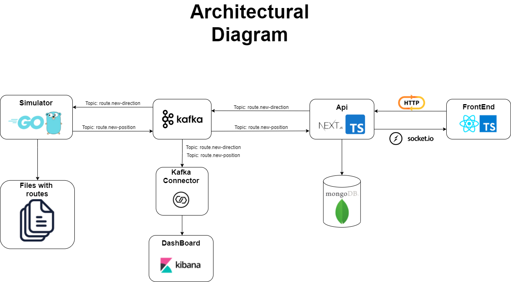

<h1 align="center">Code Delivery</h1>

## 💻 Sobre o projeto

Code Delivery: Construir um ecossistema de delivery baseado em micro serviços, com um dashboard apresentando metricas sobre as rotas percorridas pelos entredagores.

## ⚙️ Arquitetura do projeto

## ⚙️ Como executar o projeto
...

💡É necessario executas os serviços para que o ecossistema funcione.

### Pré-requisitos

Antes de começar, você vai precisar ter instalado em sua máquina as seguintes ferramentas:
[Git](https://git-scm.com),
[Docker](https://hub.docker.com/editions/community/docker-ce-desktop-windows/).

<h4 align="center">
	🚧 Em construção... 🚧
</h4>